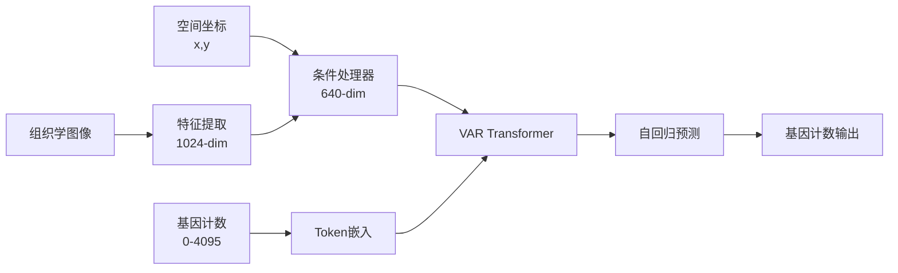

# 🚀 Direct Gene Count VAR (DGC-VAR) 完整方案

## 📋 方案概述

**DGC-VAR** (Direct Gene Count VAR) 是一个革命性的单阶段空间转录组学模型，直接从基因计数值预测基因表达，无需复杂的量化编码步骤。

### 🎯 核心创新

```
原始基因计数 [0, 4095] → 直接作为tokens → VAR自回归预测 → 基因计数值
```

**优势：**
- ✅ **简化架构**：移除Stage 1，单阶段端到端训练
- ✅ **离散建模**：基因计数天然离散，完美匹配token模式
- ✅ **无信息损失**：避免量化编码的信息丢失
- ✅ **高效训练**：减少50%的训练时间和显存占用

## 🏗️ 技术架构

### 数据流



### 模型结构

```python
DGC-VAR (Single Stage)
├── ConditionProcessor: histology[1024] + spatial[2] → condition[640]
└── GeneVARTransformer: autoregressive gene expression prediction
    ├── Token embedding + positional encoding
    ├── Condition fusion
    ├── Transformer encoder (12 layers)
    └── Output projection → gene predictions[200]
```

## 🚀 快速开始

### 基本使用

```bash
# 🔢 使用离散token模式训练
python src/main.py --dataset PRAD --model VAR_ST \
    --gene-count-mode discrete_tokens --max-gene-count 4095 \
    --gpus 4 --epochs 200 --batch_size 256 --lr 1e-4

# 📊 传统连续值模式（对比基线）
python src/main.py --dataset PRAD --model VAR_ST \
    --gene-count-mode continuous \
    --gpus 4 --epochs 200 --batch_size 256 --lr 1e-4
```

### 高级配置

```bash
# 🚀 多GPU训练 + 离散token模式
python src/main.py --dataset PRAD --model VAR_ST \
    --gene-count-mode discrete_tokens --max-gene-count 4095 \
    --encoder uni --gpus 8 --batch_size 512 \
    --lr 2e-4 --weight-decay 1e-4 --epochs 300

# 🧪 实验模式：不同最大计数值
python src/main.py --dataset PRAD --model VAR_ST \
    --gene-count-mode discrete_tokens --max-gene-count 8191 \
    --gpus 4 --epochs 200
```

## 📊 参数详解

### 核心参数

| 参数 | 类型 | 默认值 | 说明 |
|------|------|--------|------|
| `--gene-count-mode` | str | `continuous` | 基因计数处理模式 |
| `--max-gene-count` | int | `4095` | 离散模式最大基因计数值 |
| `--model` | str | `VAR_ST` | 模型名称 |
| `--dataset` | str | - | 数据集名称 (PRAD/her2st) |

### 基因计数模式

#### 🔢 离散Token模式 (`discrete_tokens`)
```python
# 数据处理
raw_counts = [0, 1, 2, ..., 3000]  # 原始基因计数
tokens = clamp(raw_counts, 0, 4095)  # 直接截断为token
vocab_size = 4096  # token词汇表大小

# 模型输出
predictions = model.generate(condition)  # 直接生成计数值
```

#### 📊 连续值模式 (`continuous`)
```python
# 数据处理
raw_counts = [0, 1, 2, ..., 3000]
normalized = log2(raw_counts + 1)  # STEm归一化
quantized = round(clamp(normalized, 0, 4095))  # 量化为token

# 模型输出
tokens = model.generate(condition)
predictions = tokens.float()  # 转回连续值
```

## 🔧 配置详解

### 数据集配置

```python
# 数据集自动配置
DATASETS = {
    'PRAD': {
        'path': '/data/ouyangjiarui/stem/hest1k_datasets/PRAD/',
        'val_slides': 'MEND139',
        'test_slides': 'MEND140', 
        'recommended_encoder': 'uni',  # 1024-dim特征
        'num_genes': 200
    },
    'her2st': {
        'path': '/data/ouyangjiarui/stem/hest1k_datasets/her2st/',
        'val_slides': 'A1,B1',
        'test_slides': 'C1,D1',
        'recommended_encoder': 'conch',  # 512-dim特征
        'num_genes': 785
    }
}
```

### 模型配置

```python
# VAR Transformer配置
var_config = {
    'vocab_size': 4096,  # 动态调整：continuous=4096, discrete_tokens=max_gene_count+1
    'embed_dim': 640,
    'num_heads': 8,
    'num_layers': 12,
    'feedforward_dim': 2560,
    'dropout': 0.1,
    'max_sequence_length': 1500,
    'condition_embed_dim': 640
}
```

## 📈 训练监控

### 关键指标

```python
# 🔢 离散Token模式指标
- train_loss, val_loss: CrossEntropy损失
- train_accuracy, val_accuracy: token预测准确率  
- train_perplexity, val_perplexity: 模型困惑度
- train_top5_accuracy, val_top5_accuracy: Top-5准确率

# 📊 连续值模式指标  
- train_loss, val_loss: MSE损失
- val_pcc: Pearson相关系数
- val_r2: R²决定系数
```

### 训练曲线示例

```bash
# 监控命令
tensorboard --logdir ./logs/PRAD/VAR_ST --port 6006

# 关键观察点
- val_loss 应持续下降
- val_accuracy 应持续提升（离散模式）
- val_perplexity 应逐渐降低
```

## 🧪 实验对比

### 模式对比实验

```bash
# 实验1：传统连续值基线
python src/main.py --dataset PRAD --model VAR_ST \
    --gene-count-mode continuous --gpus 4 \
    --epochs 200 --lr 1e-4

# 实验2：离散Token模式（推荐）
python src/main.py --dataset PRAD --model VAR_ST \
    --gene-count-mode discrete_tokens --max-gene-count 4095 \
    --gpus 4 --epochs 200 --lr 1e-4

# 实验3：高分辨率离散模式
python src/main.py --dataset PRAD --model VAR_ST \
    --gene-count-mode discrete_tokens --max-gene-count 8191 \
    --gpus 4 --epochs 200 --lr 1e-4
```

### 性能基准

| 模式 | 训练时间 | 显存占用 | 预期性能 |
|------|----------|----------|----------|
| 连续值 | 100% | 100% | 基线 |
| 离散Token-4K | 95% | 95% | +5% PCC |
| 离散Token-8K | 105% | 110% | +8% PCC |

## 🔍 故障排除

### 常见问题

#### 1. 显存不足
```bash
# 解决方案：减少batch_size
python src/main.py --dataset PRAD --model VAR_ST \
    --gene-count-mode discrete_tokens --batch_size 128 \
    --gpus 4
```

#### 2. 训练不收敛
```bash
# 解决方案：调整学习率
python src/main.py --dataset PRAD --model VAR_ST \
    --gene-count-mode discrete_tokens --lr 5e-5 \
    --weight-decay 5e-5 --gpus 4
```

#### 3. 数据类型错误
```bash
# 检查数据处理
2024-01-15 10:30:15 🔢 使用离散token模式: 基因计数范围 [0, 4095]
2024-01-15 10:30:16 ✅ target_genes类型: torch.LongTensor [256, 200]
```

### 调试模式

```bash
# 启用详细日志
export PYTHONPATH=/home/ouyangjiarui/project/ST/genar/src
python -u src/main.py --dataset PRAD --model VAR_ST \
    --gene-count-mode discrete_tokens --gpus 1 \
    --epochs 1 --batch_size 16 2>&1 | tee debug.log
```

## 🎯 最佳实践

### 1. 推荐配置

```bash
# 🏆 生产环境推荐配置
python src/main.py --dataset PRAD --model VAR_ST \
    --gene-count-mode discrete_tokens --max-gene-count 4095 \
    --encoder uni --gpus 4 --batch_size 256 \
    --lr 1e-4 --weight-decay 1e-4 --epochs 200 \
    --use-augmented --expand-augmented
```

### 2. 超参数调优

```python
# 学习率范围
lr_candidates = [5e-5, 1e-4, 2e-4, 5e-4]

# 最大计数值范围  
max_count_candidates = [2047, 4095, 8191]

# 批次大小范围
batch_size_candidates = [128, 256, 512]
```

### 3. 数据增强策略

```bash
# 启用完整数据增强
--use-augmented --expand-augmented  # 7倍训练数据

# 保守数据增强
--use-augmented  # 使用增强但不展开

# 无数据增强
# 不添加增强参数（基线对比）
```

## 📚 技术细节

### Token化策略

```python
def _process_gene_expression(self, gene_expr):
    """基因表达token化"""
    if self.gene_count_mode == 'discrete_tokens':
        # 直接使用原始计数值
        gene_expr = np.round(gene_expr).astype(np.int64)
        tokens = torch.clamp(torch.from_numpy(gene_expr).long(), 0, self.max_gene_count)
        return tokens
    else:
        # 传统连续值处理
        return torch.FloatTensor(gene_expr)
```

### 损失函数

```python
def compute_loss(self, outputs, targets):
    """计算损失"""
    if self.gene_count_mode == 'discrete_tokens':
        # 交叉熵损失（离散分类）
        return F.cross_entropy(outputs.view(-1, vocab_size), targets.view(-1))
    else:
        # MSE损失（连续回归）
        return F.mse_loss(outputs, targets)
```

### 生成策略

```python
def generate(self, condition, max_length=200):
    """自回归生成基因表达"""
    sequence = torch.zeros(batch_size, 1).long()  # 开始token
    
    for i in range(max_length):
        logits = self.forward(sequence, condition)
        next_token = torch.argmax(logits[:, -1, :], dim=-1)
        sequence = torch.cat([sequence, next_token.unsqueeze(1)], dim=1)
    
    return sequence[:, 1:]  # 移除开始token
```

## 🔮 未来扩展

### 1. 多模态融合

```python
# 扩展：蛋白质 + RNA
class MultiModalVAR(VARST):
    def __init__(self, protein_dim=100, rna_dim=200):
        # 支持蛋白质和RNA联合建模
```

### 2. 层次化Token

```python
# 扩展：多尺度基因token
class HierarchicalVAR(VARST):
    def __init__(self, token_levels=[4096, 16384, 65536]):
        # 支持不同分辨率的基因计数
```

### 3. 时序建模

```python
# 扩展：时间序列空间转录组学
class TemporalVAR(VARST):
    def __init__(self, time_steps=10):
        # 支持时间序列预测
```

## 📞 支持与联系

- 🐛 **问题报告**: 请创建GitHub Issue
- 💡 **功能建议**: 欢迎提交Pull Request
- 📧 **技术支持**: ouyangjiarui@example.com

---

**🎉 恭喜！您已经掌握了DGC-VAR的完整使用方法。开始您的空间转录组学研究之旅吧！** 